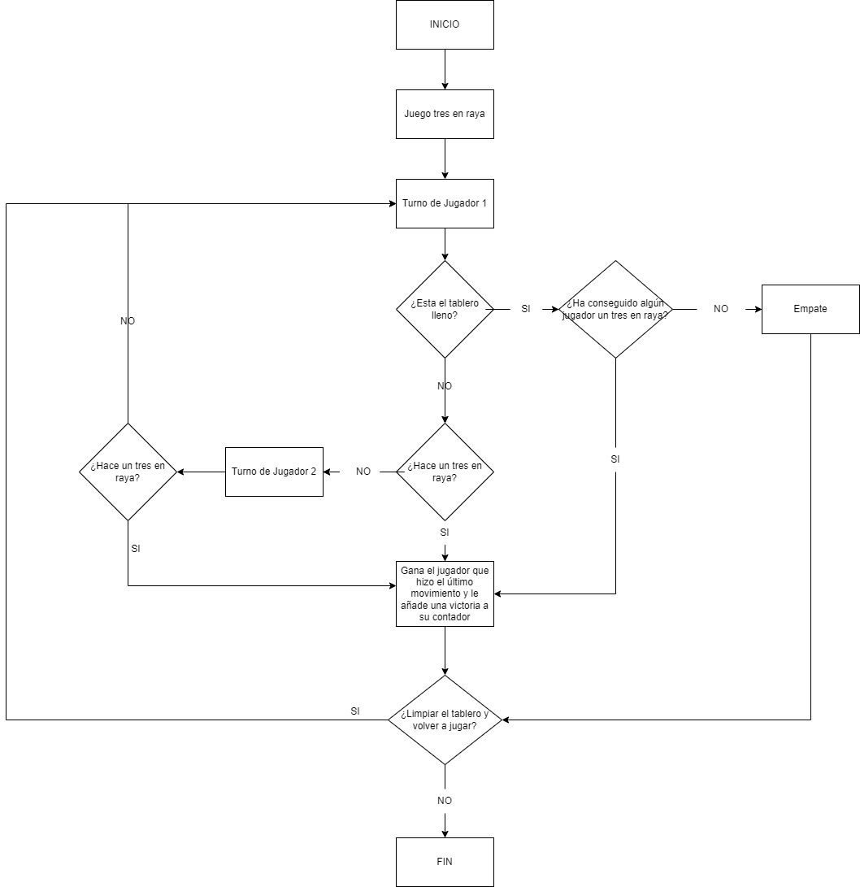
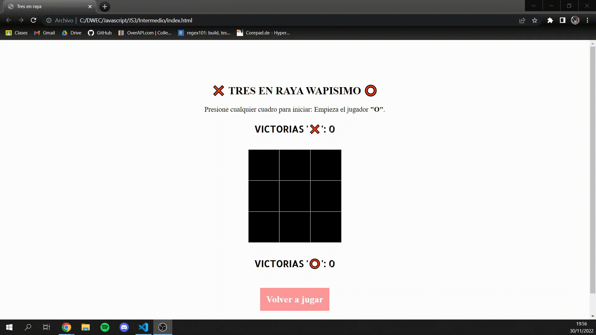
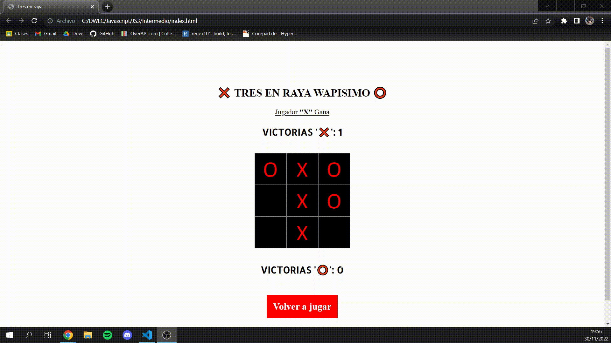
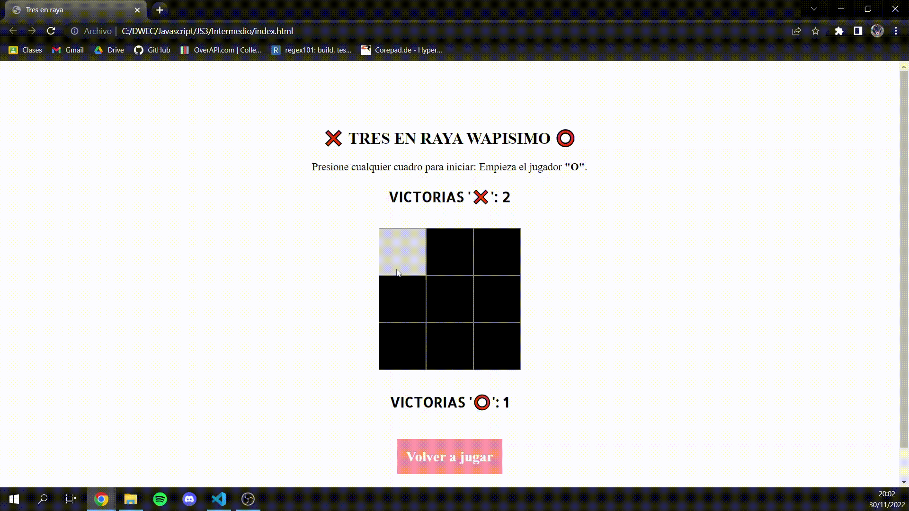

## JavaScript Tarea 3

> Tarea Intermedia.

###  Análisis del problema ❓

Queremos hacer un juego de tres en raya por navegador, que sea multijugador local y tenga un contador de victorias para cada jugador.

---

###  Diseño de la solución 🛠️

Para realizar la tarea tendremos que hacer varias funciones en el script: una que nos pinte la tabla, otra que nos pinte las fichas de los jugadores en la tabla y por ultimo una que nos compruebe las posiciones de las fichas para dar o no la victoria del jugador o inclusive el empate, y que tenga un contador de las victorias.

 

---

### Implementación 💥

En una funcion ejecutaremos la creación de una tabla con el listado de los países y sus capitales gracias a un listado creado previamente. Otras dos funciones mas, harán el trabajo de filtro para los buscadores que tendrán la página web.

---
###  Pruebas 👨‍💻

**Prueba del script**
 
 
 
Prueba en donde el Jugador X gana la partida ⬇️
 
 

 
 
Prueba en donde el Jugador O gana la partida ⬇️
 
 

 
 
Prueba en donde la partida queda en empate, las puntuaciones no cambian ⬇️
 
 

