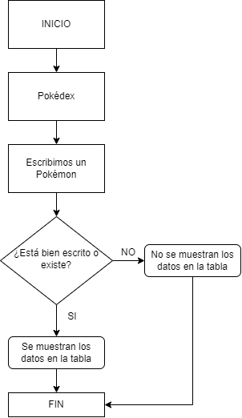
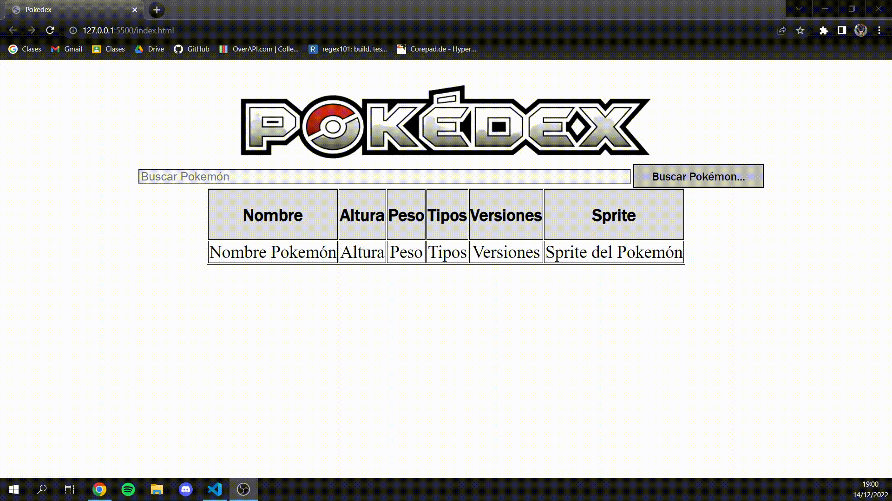

## JavaScript Tarea 4

> Tarea Intermedia.

###  Análisis del problema ❓

Queremos hacer una Pokédex que nos muestre varios datos de un pokémon que buscamos.

---

###  Diseño de la solución 🛠️

Para realizar la tarea tendremos que hacer varias funciones en el script: una que nos haga varias consultas hacia la PokeAPI para recoger los datos del pokémon, otra para que nos
recoja los datos de la consulta.

 

---

### Implementación 💥

Ejecutaremos las funciones en un HTML para poder representar los datos de los pokémon en una tabla.

---
###  Pruebas 👨‍💻

**Prueba del script**
 
 
 
Prueba en donde buscamos correctamente un Pokémon (Buscamos Garchomp, que esta correctamente escrito) ⬇️
 
 

 
 
Prueba en donde buscamos un Pokémon pero escrito erróneamente (Buscamos "Piquechu", que esta mal escrito) ⬇️
 
 

 
 
